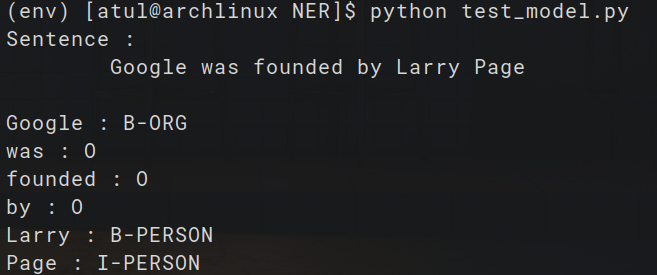

# 🧠 Custom Named Entity Recognition (NER) using CRF

This is a minimal yet complete implementation of a custom **Named Entity Recognition (NER)** model using **Conditional Random Fields (CRF)**. Designed from scratch for educational and research purposes, the system is trained on a **small, manually annotated dataset**, demonstrating the foundational logic behind sequence labeling in NLP.

---

## 📌 Features

- ✅ Custom dataset (manually annotated)
- ✅ Token-level feature engineering
- ✅ Trained using CRF (sklearn-crfsuite)
- ✅ Works on custom input sentences
- ✅ Output: token-level entity tagging (ORG, PERSON, etc.)
- ✅ Simple and readable implementation

---
## Requirements:
- Python
- sklearn-crfsuite
- pickle

 ## 📚 Learning Objective

This project was built to:

    Understand the structure of NER systems

    Explore CRF modeling for NLP tasks

    Learn practical annotation and data preparation

    Serve as a base for custom NER systems (with custom tag sets)
