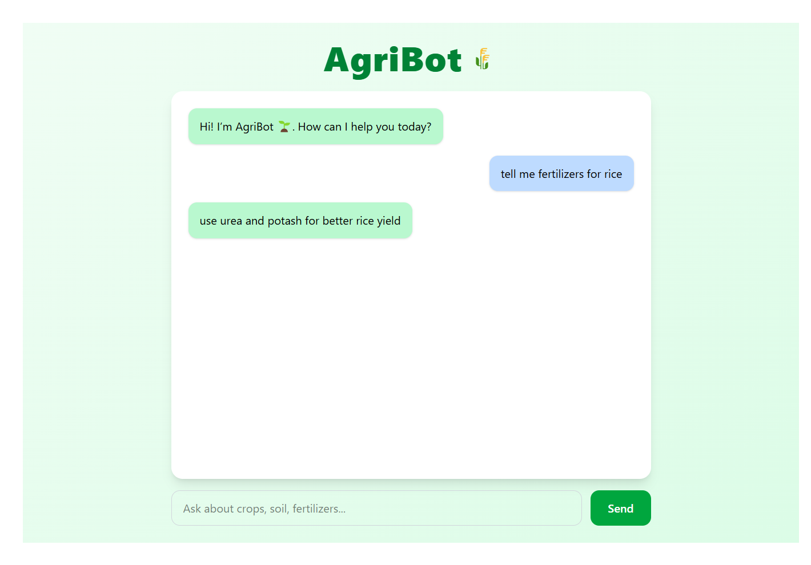

Sure! Here's a more visually impressive, polished, and well-structured version of your markdown with enhanced formatting, icons, and readability improvements:

---

# 🌾 **AgriBot – Smart Farming Assistant**

AgriBot is an **AI-powered chatbot** designed to help farmers with agricultural queries including crop management, fertilizers, soil health, and more. Built with a **Seq2Seq model enhanced by attention mechanism**, AgriBot offers natural, intuitive conversations for better farming decisions.

---

## 🔧 **Tech Stack**

| 🖼 Frontend            | 🔙 Backend | 🧠 Machine Learning               |
|------------------------|------------|----------------------------------|
| React + TailwindCSS    | Flask      | Seq2Seq (Encoder–Decoder) Model |
| JavaScript             | CORS       | PyTorch, NLTK, Tokenization     |
| HTML/CSS               |            | Custom Vocabulary Handling      |

---

## 🚀 **Features**

- 💬 Natural conversations on farming & crops  
- 🧠 AI-powered deep learning chatbot  
- 🔄 Real-time communication via Flask API  
- 🎨 Clean, responsive UI with TailwindCSS  
- 🔌 Local development with CORS-enabled APIs  

---

## 📁 **Project Structure**

```
AgriBot/
├── frontend/           # React Frontend (UI)
│   ├── App.jsx
│   └── App.css
│
├── backend/            # Flask Backend & ML Model
│   ├── app.py
│   ├── model.py
│   ├── utils.py
│   ├── vocab.py
│   ├── encoder.pth
│   ├── decoder.pth
│   ├── input_vocab.pkl
│   └── output_vocab.pkl
│
└── README.md
```

---

## ✅ **Setup Instructions**

### 🧪 1. Clone the Repository

```bash
git clone https://github.com/your-username/agri-bot.git
cd agri-bot
```

### ⚙️ 2. Backend Setup

```bash
cd backend
python -m venv venv
source venv/bin/activate     # Windows: venv\Scripts\activate
pip install -r requirements.txt
```

Make sure these files exist in the `backend/` folder:
- `encoder.pth`
- `decoder.pth`
- `input_vocab.pkl`
- `output_vocab.pkl`

Start the backend server:
```bash
python app.py
```
> 🔗 Backend runs at: [http://127.0.0.1:5000](http://127.0.0.1:5000)

---

### 🖥️ 3. Frontend Setup

```bash
cd frontend
npm install
npm run dev
```
> 🌐 App will be available at: [http://localhost:5173](http://localhost:5173)

---

## 💡 **Example Interaction**

**User**: _"Tell me fertilizers for rice"_  
**AgriBot**: _"Use urea and potash for better rice yield."_

---

## 📸 **Screenshots**

### 💻 Desktop View  

---

## 🧠 **Model Info**

- **Architecture**: Encoder–Decoder LSTM with attention
- **Framework**: PyTorch
- **Tokenizer**: NLTK with custom vocabulary
- **Max Response Length**: 15 tokens

---

## 🛠 **To-Do List**

- 🎙️ Add speech-to-text input  
- 💾 Save chat history  
- 🔐 Implement user authentication  
- 📱 Improve responsive mobile design  

---

Feel free to let me know if you want a GitHub-style README badge layout, contribution guidelines, or a prettier visual demo section!